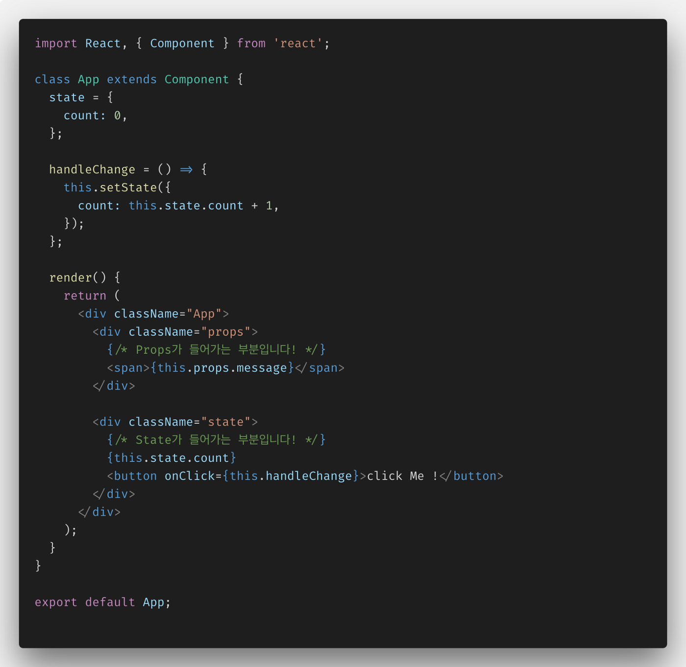

# `props`와 `state`

들어가기 앞서, 이 둘을 요약 비교하겠습니다.

- State는 현재 컴포넌트 내에서 변경이 가능하다.
- Props는 현재 컴포넌트 내에서 변경이 불가능하다. (예전 리액트 버전에서는 가능했으나 현재 버전에서는 사용하지 않는 것을 추천)
- Props와 State 모두 하위 컴포넌트에 상속이 가능하다.

## `props`
> 컴포넌트가 가지는 특성

우선 App.js가 Props로 사용할 수 있게 전달해 주고 있습니다. 상속을 시켜준 것이죠. 이렇게 받은 message 라는 문자열을 App.js에서는 이렇게 사용할 수 있습니다.

this.props.message, App.js에서는 state를 사용하듯이 사용하면 됩니다. 다만, Props는 State 처럼 변경할 수 없습니다. 

하지만 Props를 절대로 변경할 수 없는 것은 아닙니다. App.js에 다른 컴포넌트를 상속시켜서 Props를 변경이 가능합니다.

## `State`

- `State` 는 하나의 컴포넌트가 가질 수 있는 변경 가능한 데이터 입니다. 컴포넌트를 렌더링 할 때 새로운 데이터를 생성해야 한다던지, 아니면 기존의 데이터를 참고해서 새로운 데이터를 만들어야 할 때 사용할 수 있습니다.

- State 뿐만 아니라 JSX에 변수를 넣을 때에는 중괄호 {}에 담아야 합니다.

결론은, state는 현재 컴포넌트 안에서 새로운 데이터를 만들어 낼 때 사용합니다. 