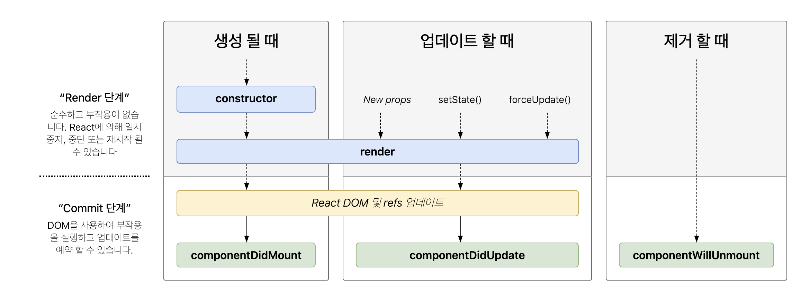

# life-cycle
> [참고 링크](https://medium.com/wasd/%EA%B8%B0%EC%B4%88%EB%B6%80%ED%84%B0-%EB%B0%B0%EC%9A%B0%EB%8A%94-react-part-6-5bb4b072621a)

우리는 JSX 문법을 통해서 HTML과 비슷한 형태로 작성을 하고, 그 파일을 리액트가 HTML로 변환시켜 렌더링을 시킨다는 사실을 알고 있지만 정확히 어떤 타이밍인지 알지 못하고 있습니다. 이를 명확히 합니다.

## Mounting
> 리액트 코드 첫 렌더링의 시작

1. constructor: 리액트 컴포넌트 클래스를 만들어도, 클래스의 기본 특성은 생성자가 먼저 실행된다는 점입니다. 당연히 첫번째로 생성자가 먼저 동작하죠.
2. render: 렌더링을 위해 작성해둔 JSX를 return해주는 메소드가 작동합니다. 아직 이 부분에서는 브라우저에 아무것도 없어요.
3. componentDidMount: 리액트 코드가 HTML로 변환되어 화면에 나타났습니다. 이제 우리는 document.getElementById를 통해서 선택자를 통해 DOM 요소를 가져올 수 있게 되었습니다. 여기에 DOM에 HTML코드가 업데이트 된 직후 수행해야 하는 작업을 수행하면 됩니다. componentDidMount는 딱 한번만 수행됩니다. (첫 렌더링 직후에만)

> 리액트에서 document.getxxx 과 같은 실제 DOM의 요소를 가져오는 메소드를 수행하지 마세요. 실제 DOM관리를 위해서 ref라는 도구를 제공하니 ref를 사용하세요.

## Updateing
> 리액트의 state나 props가 업데이트 되었을 때

컴포넌트가 가지고 있는 props나 state가 업데이트 되었을 때에 수행되는 부분입니다. props나 state가 업데이트 되는것을 리액트는 어떻게 감지할까요?

1. `render()`: state나 props, 즉 보여주어야 하는 데이터가 업데이트 되었으면 다시 render를 수행해야 합니다.
2. `componentDidUpdate()`: 컴포넌트가 업데이트 되었을 때에 수행되는 메소드로, 인자를 받습니다. prevProps와 prevState입니다. 현재 업데이트 된 props와 업데이트 되기 전 props, 업데이트 되기 전 state와 현재 업데이트 된 state를 비교해서 원하는 작업을 수행할 수 있습니다.

- setState메소드: state를 업데이트 하려면 반드시 setState를 수행해야 합니다. 리액트는 이 메소드 가 수행되었을 때 컴포넌트를 업데이트 합니다.

- props가 업데이트 되었을 때, 부모 컴포넌트에서 setState를 수행하여 현재 컴포넌트가 가지고 있는 props가 업데이트 되었을 때에도 리액트 컴포넌트는 업데이트 됩니다.

## Unmounting
> 컴포넌트가 사라질 때

컴포넌트에 setInterval과 같은 작업을 진행했을 때에 이 부분은 컴포넌트가 단순히 사라진다고 해서 없어지지 않습니다. 메모리에 좀비처럼 상주할 가능성이 있는 변수들을 여기서 null 을 할당함으로 사용되지 않을 작업들을 해제해줄 수 있습니다. 이 때 사용되는 메소드는 다음과 같습니다.

- `componentWillUnMount`
  - 컴포넌트가 사라질 때에만 수행됩니다. 이 때 여러분이 setInterval과 같은 작업을 했을 경우에 여기서 해제시켜 주시면 됩니다.